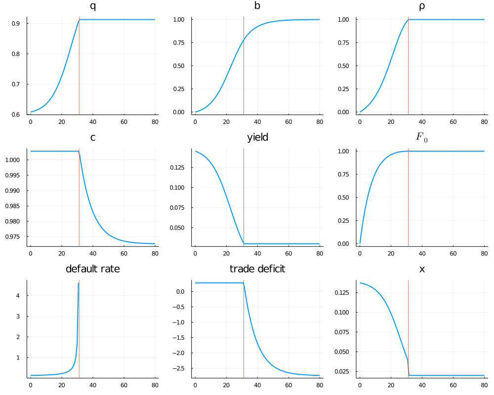

# Simulation for Reputation and Sovereign Default 

This file contains the code that solves the model and generates Figure 1 in the 
paper ["Reputation and  Sovereign Default"](https://manuelamador.me/files/reputation.pdf) by Manuel Amador and Christopher Phelan. 

## Running the code 

The code is in Julia. From the root of this folder run julia and: 

    using Pkg
    Pkg.activate(".")
    Pkg.instantiate()

    include(joinpath("scripts", "run.jl"))

The script solves the model and outputs the parameters, the value of `T` and the value of `m`. 

The PDF figure is saved in the `output` folder. 

