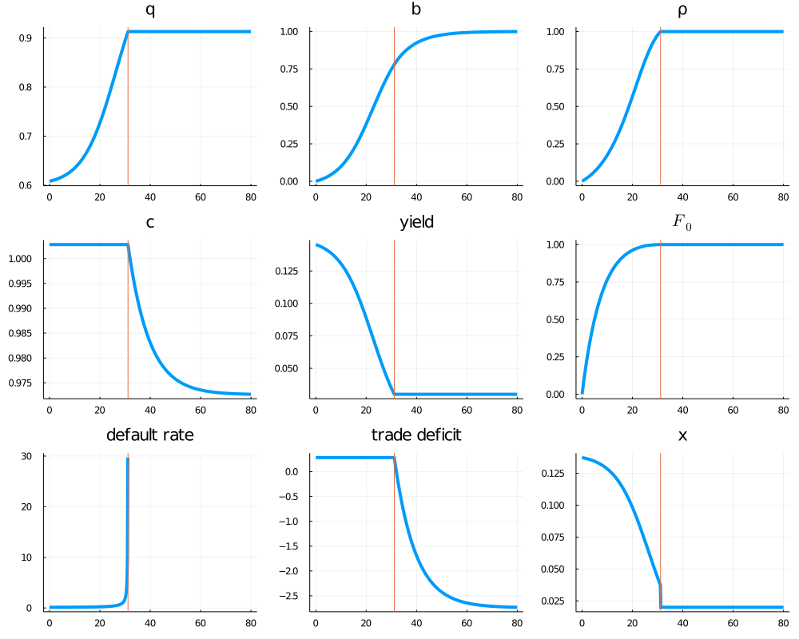

# Simulation for Reputation and Sovereign Default 

This file contains the code that solves the model and generates Figures 1 and 2 in the 
paper ["Reputation and  Sovereign Default"](https://manuelamador.me/files/reputation.pdf) by Manuel Amador and Christopher Phelan. 

## Running the code 

The code is in Julia. To run the code download and install [julia](https://julialang.org/downloads/). 

Download this repository and navigate to its root folder. 

Run julia and use the following commands to make sure that you have the necessary packages:

    using Pkg
    Pkg.activate(".")
    Pkg.instantiate()

Then, run the script `scripts/run.jl`:

    include(joinpath("scripts", "run.jl"))

The script solves the model, outputs the parameters, the value of `T`, the value of `m`, and 
generates Figure 1 and 2.  The figures are saved in the `output` subdirectory. 

### Figure 1 

### Figure 2

